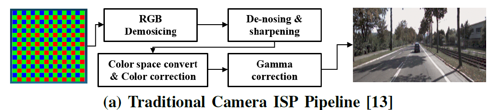
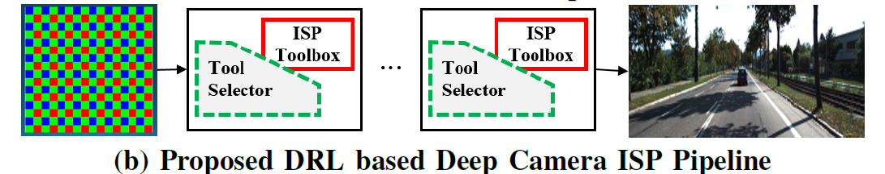
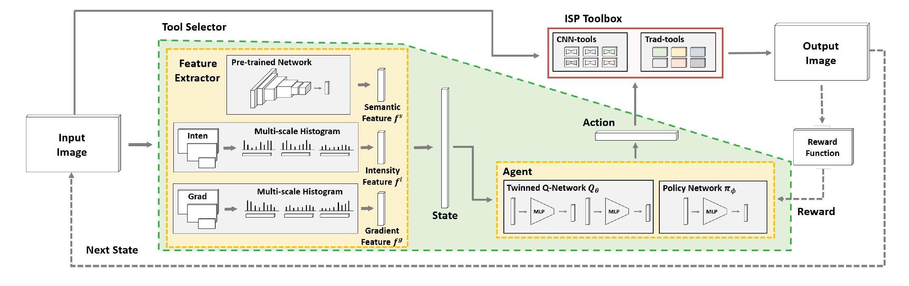
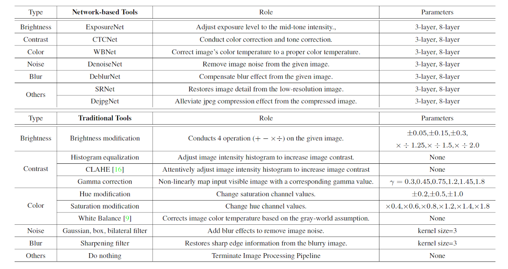
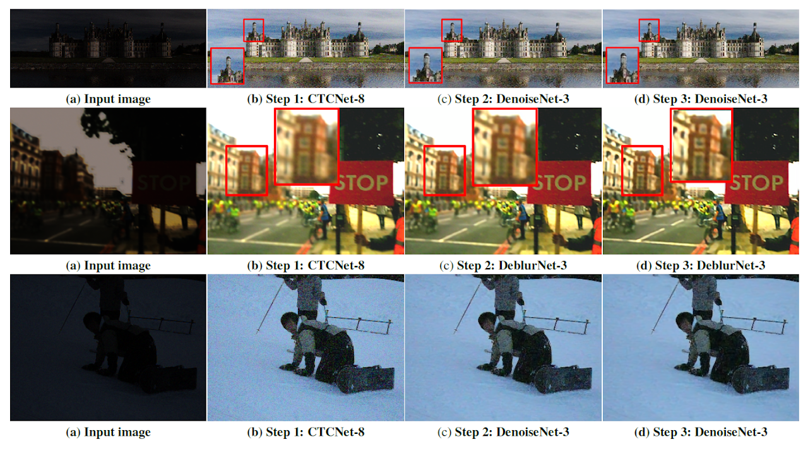
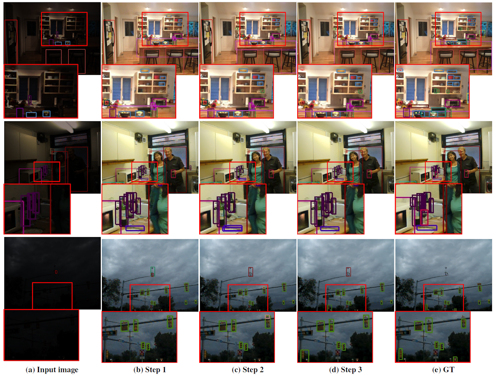
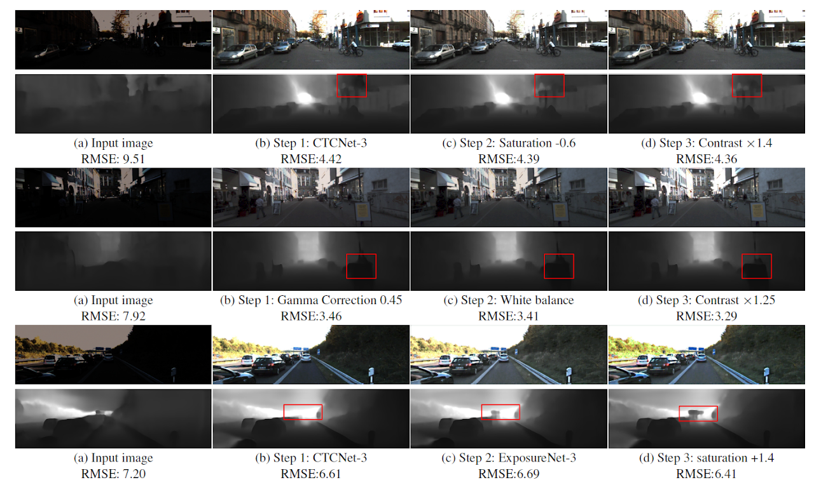

# DRL-ISP: Multi-Objective Camera ISP with Deep Reinforcement Learning

This github is a official implementation of the paper:

 >DRL-ISP: Multi-Objective Camera ISP with Deep Reinforcement Learning
 >
 >[Ukcheol Shin](https://ukcheolshin.github.io/), [Kyunghyun Lee](https://kyunghyunlee.github.io/), In So Kweon
 >
 > First two authors equally contributed
 >
 >**IEEE/RSJ International Conference on Intelligent Robots and Systems (IROS) 2022**
 >
 >[[Paper](https://arxiv.org/abs/2207.03081)] [[Project webpage](https://sites.google.com/view/thermal-monodepth-project-page)]

## Introduction
In this paper, we propose a multi-objective camera ISP framework that utilizes Deep Reinforcement Learning (DRL) and camera ISP toolbox that consist of network-based and conventional ISP tools. The proposed DRL-based camera ISP framework iteratively selects a proper tool from the toolbox and applies it to the image to maximize a given vision task-specific reward function. For this purpose, we implement total 51 ISP tools that include exposure correction, color-and-tone correction, white balance, sharpening, denoising, and the others. We also propose an efficient DRL network architecture that can extract the various aspects of an image and make a rigid mapping relationship between images and a large number of actions. Our proposed DRL-based ISP framework effectively improves the image quality according to each vision task such as RAW-to-RGB image restoration, 2D object detection, and monocular depth estimation.

## Deep Reinforcement Learning based Camera ISP framework
<p align="center">
 
 
</p>

<p align="center">
  
</p>

### Camera ISP Toolbox

<p align="center">
  
</p>

### Camera ISP Tool Selector Results
#### 1. Step-wise ISP Tool Selection Result for PSNR reward

<p align="center">
  
</p>

#### 2. Step-wise ISP Tool Selection Result for Object Detection

<p align="center">
  
</p>

#### 3. Step-wise ISP Tool Selection Result for Single-view Depth Estimation

<p align="center">
  
</p>

## Getting Started

### 0. Prerequisite
This codebase was developed and tested with python 3.7, Pytorch 1.5.1, and CUDA 10.2 on Ubuntu 16.04. 
Modify "prefix" of the environment.yml file according to your environment.

```bash
conda env create --file environment.yml
conda activate pytorch1.5_rl
```

For the raw2rgb for detection task, you need to additionally install [detectron2](https://github.com/facebookresearch/detectron2).

### 1. Datasets

#### (1) RGB data
In order to train and evaluate our code, you need to download [DIV2K](https://data.vision.ee.ethz.ch/cvl/DIV2K/), [MSCOCO](https://cocodataset.org/#detection-2017), and [KITTI detection](http://www.cvlibs.net/datasets/kitti/eval_object.php) dataset.

Also, [Rendered WB dataset (Set2)](https://cvil.eecs.yorku.ca/projects/public_html/sRGB_WB_correction/dataset.html) dataset is required to train white-balance tools.

For the depth task, we used [the pre-processed KITTI RAW dataset](https://onedrive.live.com/?authkey=%21APJe3iYIo1ul2LA&cid=36712431A95E7A25&id=36712431A95E7A25%21476&parId=36712431A95E7A25%21472&action=locate) of [SC-SfM-Learner](https://github.com/JiawangBian/SC-SfMLearner-Release)

#### (2) Bayer data
We convert RGB images of each dataset into the Bayer pattern images by utilizing [this Github](https://github.com/cucapra/approx-vision)

However, it taks a lots of time, we provide [pre-processed RAW datasets](https://kaistackr-my.sharepoint.com/:f:/g/personal/shinwc159_kaist_ac_kr/EupH54Uk3ZhMvfXvN_FXJ_kBpFuxMpFV2k0senDhdpja3g?e=sfJo6E).

After download our pre-processed dataset, unzip the files to form the below structure.

#### (3) Expected dataset structure for DRL-ISP:
```
Dataset_DRLISP/
  RGB/
    DIV2K/
      DIV2K_train_HR/
      DIV2K_valid_HR/
    KITTI_detection/
      data_object_images_2/
    KITTI_depth/
      KITTI_SC/
        2011_09_26_drive_0001_sync_02/
        ...
    MS_COCO/
      train2017/
      val2017/
      test2017/
      annotation/
  RAW/
    DIV2K/
      DIV2K_train_HR/
      DIV2K_valid_HR/
    KITTI_detection/
      data_object_images_2/
    KITTI_depth/
      KITTI_SC/
        2011_09_26_drive_0001_sync_02/
        ...
    MS_COCO/
      train2017/
      val2017/
      test2017/
      annotation/
    Set2/
      train/
      test/
```

#### (4) Prepare training/testing dataset for DRL-ISP:

Upon the above dataset structure, you can generate training/testing dataset by running the script.

```bash
cd tool_trainner
sh scripts/1.prepare_dataset.sh
```

or you can quickly start from [our pre-prossed synthetic RAW/RGB dataset](https://kaistackr-my.sharepoint.com/:f:/g/personal/shinwc159_kaist_ac_kr/Em7PP2NyDwhGiZjm4npK-XEB4aMYD583GsOFWhHEtxXGVg?e=Wfo4Gb) without downloading all above RGB and RAW dataset ((1),(2)) and preparing traning/testing dataset (4).

You can diretly train each tool and tool selector for RAW2RGB task from our pre-prossed RAW/RGB dataset.

### 2. Tool Training

#### (1) Individual Tool Training
You can individual network-based tool by running the script.
```bash
sh scripts/2.train_individual.sh
```

#### (2) Collective Tool Training
After individual tool training stage, you can train the tools collective way.
```bash
sh scripts/3.train_jointly.sh
```

#### (3) Move the tools for tool selector training
After collective tool training stage, copy trained tools for the tool-selector training.
```bash
sh scripts/4.copy_weights.sh
```

You can start a `tensorboard` session in the folder to see a progress of each training stage by opening [https://localhost:6006](https://localhost:6006) on your browser.
```bash
tensorboard --logdir=logs/
```
 
### 3. Tool Selector Training 

#### (1) RAW2RGB Task
```bash
cd tool_rl_selector
python main.py --app restoration --train_dir $TRAINDIR --test_dir $TESTDIR --use_tool_factor
```
For `TRAINDIR` and `TESTDIR`, specify the location of the folder **contains** `syn_dataset`.

#### (2) Object Detection Task
```bash
python main.py --app detection --train_dir $TRAINDIR --test_dir $TESTDIR --use_tool_factor --reward_scaler 2.0 --use_small_detection
```
For `TRAINDIR` and `TESTDIR`, specify the location of the folder `MS_COCO`.

#### (3) Monocular Depth Estimation Task
```bash
python main.py --app depth --train_dir $TRAINDIR --test_dir $TESTDIR --use_tool_factor
```
For `TRAINDIR`, specify the location of the folder `KITTI_sc`.
For `TESTDIR`, specify the location of the folder `kitti_depth_test`.

### 4. Evaluation

#### (1) RAW2RGB Task
```bash
python main.py --app restoration --train_dir $TRAINDIR --test_dir $TESTDIR --use_tool_factor --continue_file $CONTINUEFILE --is_test
```
For `TRAINDIR` and `TESTDIR`, specify the location of the folder **contains** `syn_dataset`.  
For `CONTINUEFILE`, specify the location of the checkpoint.

#### (2) Object Detection Task
```bash
python main.py --app detection --train_dir $TRAINDIR --test_dir $TESTDIR --use_tool_factor --reward_scaler 2.0 --use_small_detection  --continue_file $CONTINUEFILE --is_test
```
For `TRAINDIR` and `TESTDIR`, specify the location of the folder `MS_COCO`.  
For `CONTINUEFILE`, specify the location of the checkpoint.

#### (3) Monocular Depth Estimation Task
```bash
python main.py --app depth --train_dir $TRAINDIR --test_dir $TESTDIR --use_tool_factor  --continue_file $CONTINUEFILE --is_test
```
For `TRAINDIR`, specify the location of the folder `KITTI_sc`.
For `TESTDIR`, specify the location of the folder `kitti_depth_test`.
For `CONTINUEFILE`, specify the location of the checkpoint.

## Citation
Please cite the following paper if you use our work, parts of this code, and pre-processed dataset in your research.

	@inproceedings{shin2022drl,
	  title={DRL-ISP: Multi-Objective Camera ISP with Deep Reinforcement Learning},
	  author={Shin, Ukcheol and Lee, Kyunghyun and Kweon, In So},
	  booktitle={2022 IEEE/RSJ International Conference on Intelligent Robots and Systems (IROS)},
	  pages={7044--7051},
	  year={2022},
	  organization={IEEE}
	}
